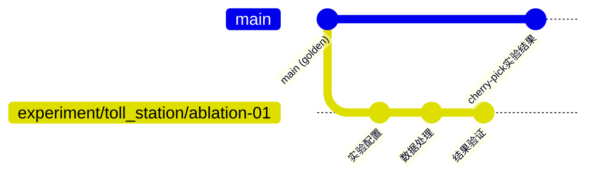

# Data Release Repository 分支规范

作者：
版本：v1.0.0
更新时间：2025-09-23

## 概述

本文档定义了 `data_release_repo` 的Git分支管理规范，用于训练数据集的版本控制、数据策划操作追踪和发布管理。

## 分支架构图

```
main (稳定主分支)
├── develop (开发集成分支)
├── feature_dataset/<topic>/<method> (功能数据集分支)
├── experiment/<topic>/<trial> (实验分支)
├── release/<version> (发布分支)
└── hotfix/<version>-<issue> (热修复分支)
```

## 分支类型与规范

### 1. 主要分支 (Long-lived Branches)

#### 1.1 main 分支
- **用途**: 生产环境的稳定版本，仅包含已发布的训练数据集
- **保护级别**: 完全保护，仅允许通过PR合并
- **合并来源**: `release/*` 和 `hotfix/*` 分支
- **特点**: 
  - 每个commit都对应一个可用的训练数据集版本
  - 通过Tag标记重要版本
  - 通过Release标记对外发布的稳定版本

#### 1.2 develop 分支
- **用途**: 开发集成分支，包含下一个发布版本的所有功能
- **保护级别**: 保护，需要PR review
- **合并来源**: `feature_dataset/*` 和 `experiment/*` 分支
- **特点**:
  - 包含已完成但未发布的数据集变更
  - 定期合并到 `release/*` 分支

### 2. 临时分支 (Short-lived Branches)

#### 2.1 功能数据集分支 (Feature Dataset Branches)

**命名规范**: `feature_dataset/<topic>/<method>`

**示例**:
- `feature_dataset/toll_station/strict` - 收费站场景严格清洗
- `feature_dataset/highway_merge/balance` - 高速合流场景数据平衡
- `feature_dataset/intersection/augment` - 路口场景数据增强

**使用场景**:
- 针对特定场景或主题的数据集开发
- 数据清洗、新增、调平等操作
- 可在IDE中直接编辑和验证

**生命周期**:
```
develop → feature_dataset/toll_station/strict → develop
```

#### 2.2 实验分支 (Experiment Branches)

**命名规范**: `experiment/<topic>/<trial>`

**示例**:
- `experiment/toll_station/ablation-01` - 收费站消融实验01
- `experiment/dagger/online-training-v2` - DAgger在线训练实验v2
- `experiment/mixed_version/bundle-comparison` - 混合版本Bundle对比实验

**使用场景**:
- 数据挖掘和处理的实验性工作
- A/B测试不同的数据处理策略
- 从golden版本进行单点实验

**特点**:
- 实验结果可cherry-pick到主分支
- 仅打内部Tag，不创建Release

#### 2.3 发布分支 (Release Branches)

**命名规范**: `release/<version>`

**示例**:
- `release/v1.2.0` - 主版本发布
- `release/v1.2.1` - 补丁版本发布

**使用场景**:
- 准备新版本发布
- 发布前的最后测试和bug修复
- 版本号确定和发布说明准备

**生命周期**:
```
develop → release/v1.2.0 → main & develop
```

#### 2.4 热修复分支 (Hotfix Branches)

**命名规范**: `hotfix/<version>-<issue>`

**示例**:
- `hotfix/v1.2.0-data-corruption` - 数据损坏紧急修复
- `hotfix/v1.1.3-obs-path-error` - OBS路径错误修复

**使用场景**:
- 生产环境紧急问题修复
- 数据质量问题快速响应

**生命周期**:
```
main → hotfix/v1.2.0-data-corruption → main & develop
```

## 工作流程

### 1. 功能数据集开发流程

```mermaid
gitGraph
    commit id: "develop"
    branch feature_dataset/toll_station/strict
    checkout feature_dataset/toll_station/strict
    commit id: "初始化配置"
    commit id: "执行数据清洗"
    commit id: "更新索引文件"
    checkout develop
    merge feature_dataset/toll_station/strict
    commit id: "合并功能分支"
```

**步骤**:
1. 从 `develop` 创建功能分支
2. 在功能分支上进行数据操作
3. 更新 `training_dataset.json`
4. 使用结构化commit message
5. 创建PR合并回 `develop`

### 2. 实验分支流程



**步骤**:
1. 从golden版本(通常是main或特定Tag)创建实验分支
2. 进行实验性数据操作
3. 验证实验结果
4. 将有价值的结果cherry-pick到目标分支

### 3. 发布流程

```mermaid
gitGraph
    commit id: "develop"
    branch release/v1.2.0
    checkout release/v1.2.0
    commit id: "准备发布"
    commit id: "修复问题"
    checkout main
    merge release/v1.2.0
    commit id: "发布v1.2.0"
    checkout develop
    merge release/v1.2.0
    commit id: "回合发布分支"
```

**步骤**:
1. 从 `develop` 创建发布分支
2. 在发布分支上进行最后的调整和bug修复
3. 创建Tag和Release
4. 合并到 `main` 和 `develop`

## 提交信息规范

### 结构化Commit Message格式

遵循现有文档中的结构化提交格式 [[memory:7284755]]:

```yaml
date: "2025-09-23"
type: "modify(clean)"   # add | modify(clean) | modify(balance)
description: "对收费站场景数据进行质量清洗"
task_tag: "TASK-12345"  # 任务单/工单编号；手动操作留空
details:
  dataset: "toll_station_scenarios_v2"
  total_clips_before: 150000
  clips_removed: 15000
  clips_after: 135000
  quality_threshold: 0.95
```

### 提交类型定义

- **add**: 新增数据集或clips
- **modify(clean)**: 清洗类修改（去重、质量过滤、整体清洗等）
- **modify(balance)**: 平衡类修改（调整场景/类别分布等）
- **fix**: 修复数据错误或配置问题
- **docs**: 文档更新
- **refactor**: 重构但不改变功能的修改

## Tag和Release策略

### Tag规范

#### 1. 专题数据交付Tag
**命名**: `feature_dataset/<topic>/release-YYYYMMDD`

**示例**:
- `feature_dataset/toll_station/release-20250923`
- `feature_dataset/highway_merge/release-20250924`

**Tag注释模板**:
```yaml
release_name: "feature_dataset/toll_station/release-20250923"
consumer_version: "v1.2.0"
bundle_version: "v1.2.0-20250620-143500"
training_dataset_version: "v1.2.0"
description: "收费站场景数据集专题交付"
datasets_count: 15
total_clips: 135000
```

#### 2. 大版本Tag
**命名**: `training/v<MAJOR>.<MINOR>.<PATCH>`

**示例**:
- `training/v1.2.0`
- `training/v1.2.1`

### Release规范

#### 1. 大版本Release
**命名**: `TrainingDataset v<MAJOR>.<MINOR>.<PATCH>`

**示例**: `TrainingDataset v1.2.0`

**Release说明模板**:
```markdown
# TrainingDataset v1.2.0

## 版本信息
- **Consumer Version**: v1.2.0
- **Bundle Versions**: ["v1.2.0-20250620-143500", "v1.1.0-20250618"]
- **发布日期**: 2025-09-23

## 数据统计
- **总数据集数量**: 25个
- **总Clips数量**: 1,250,000
- **支持训练类型**: 常规训练, DAgger训练

## 主要变更
### 新增功能
- 新增收费站场景数据集(15个数据集, 135,000 clips)
- 支持混合版本Bundle数据挖掘

### 数据优化
- 高速合流场景数据质量提升20%
- 路口场景数据平衡优化

### Bug修复
- 修复OBS路径配置错误
- 修复DAgger数据集索引问题

## 兼容性
- 向下兼容 v1.1.x
- 需要DataSpecHub v1.2.0+支持

## 迁移指南
详见: [Migration_Guide_v1.2.0.md](docs/migrations/Migration_Guide_v1.2.0.md)
```

## 分支保护策略

### main分支保护
- 禁止直接push
- 需要PR review (至少2人)
- 需要通过CI检查
- 需要管理员审批

### develop分支保护
- 禁止直接push
- 需要PR review (至少1人)
- 需要通过CI检查

### 功能分支保护
- 允许直接push (开发阶段)
- 合并时需要PR review

## 分支清理策略

### 自动清理
- 功能分支合并后7天自动删除
- 实验分支30天无更新自动删除
- 发布分支合并后保留，但归档处理

### 手动清理
- 定期清理长期未使用的分支
- 保留重要的实验分支作为参考

## CI/CD集成

### 分支触发器
```yaml
# .github/workflows/data-validation.yml
on:
  push:
    branches: 
      - main
      - develop
      - 'feature_dataset/**'
      - 'release/**'
  pull_request:
    branches:
      - main
      - develop
```

### 检查项目
1. **数据格式验证**: 验证JSON文件格式
2. **路径检查**: 验证OBS路径可访问性
3. **版本一致性**: 检查版本号一致性
4. **提交信息验证**: 验证结构化commit message

## 最佳实践

### 1. 分支命名
- 使用有意义的描述性名称
- 遵循既定的命名规范
- 避免使用特殊字符和空格

### 2. 合并策略
- 功能分支: 使用Squash merge保持历史清洁
- 发布分支: 使用Merge commit保留完整历史
- 热修复: 使用Merge commit便于追踪

### 3. Code Review
- 所有PR必须经过review
- 重点关注数据质量和配置正确性
- 验证追溯信息完整性

### 4. 版本管理
- 遵循语义化版本控制(SemVer)
- 主版本号变更需要充分讨论
- 保持与上游DataSpecHub版本的对应关系

## 故障排除

### 常见问题

#### Q: 合并冲突如何处理？
A: 
1. 首先备份本地修改
2. 使用`git fetch`更新远程分支
3. 使用`git rebase`或`git merge`解决冲突
4. 验证合并后的数据完整性

#### Q: 如何回滚已发布的版本？
A:
1. 创建hotfix分支
2. 修复问题或回滚变更
3. 打新的补丁版本Tag
4. 创建新Release说明问题和解决方案

#### Q: 实验分支结果如何合并到主分支？
A:
1. 验证实验结果的正确性
2. 使用`git cherry-pick`选择性合并commit
3. 在目标分支上创建PR
4. 经过review后合并

## 工具支持

### 推荐Git客户端
- **命令行**: Git CLI
- **图形界面**: GitKraken, SourceTree
- **IDE集成**: VS Code Git, IntelliJ Git

### 自动化脚本
- 分支清理脚本
- 版本号自动更新脚本
- Tag注释自动生成脚本
- Release说明模板生成器

## 参考资料

- [Training_Dataset_Management_Wiki.md](Training_Dataset_Management_Wiki.md)
- [Git Flow工作流](https://nvie.com/posts/a-successful-git-branching-model/)
- [语义化版本控制](https://semver.org/lang/zh-CN/)
- [DataSpecHub Consumer版本管理规范](../../compatibility/consumer_matrix.yaml)

