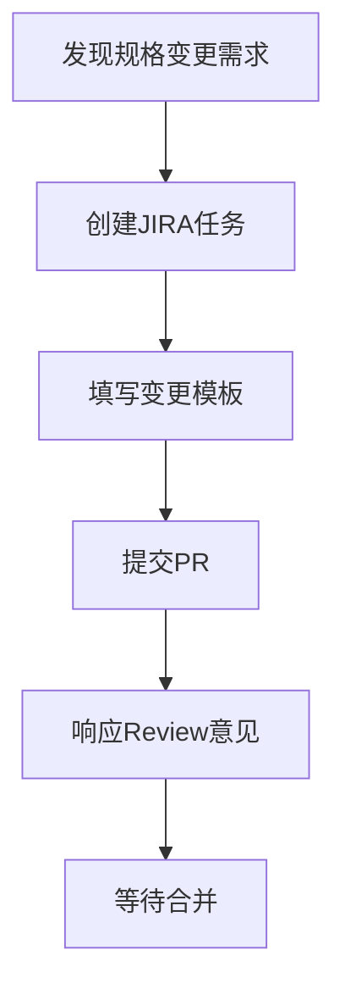

# 角色与职责定义

## 角色概览

| 角色 | 主要职责 | 维护的数据文件 | 典型用例 |
|------|----------|----------------|----------|
| **研发工程师** | 提出规格变更需求 | 无直接维护 | 新增传感器、优化数据格式 |
| **Data Steward** | 规格治理与审核 | `channels/*/spec-*.yaml`<br/>`taxonomy/channel_taxonomy.yaml` | 规格审核、分类管理 |
| **消费方代表** | 业务需求表达与影响评估 | `consumers/*.yaml` | 需求配置、兼容性评估 |
| **Release Manager** | 发布管理与版本控制 | `channels/*/release-*.yaml`<br/>`bundles/**/bundle-*.yaml` | 版本发布、Bundle创建 |
| **QA工程师** | 质量保证与测试 | `channels/*/samples/`<br/>`scripts/validate_*.py` | 格式验证、测试脚本 |
| **Platform Engineer** | 基础设施与工具维护 | `.github/workflows/`<br/>`scripts/` | CI/CD、自动化工具 |

## 详细角色定义

### 1. 研发工程师 (Developer)

#### 职责
- 识别数据规格变更需求
- 在需求系统中创建变更任务
- 提供技术实现细节和影响分析

#### 典型工作流程


#### 维护的数据文件
- **无直接维护**（通过PR提出变更建议）

#### 具体用例

**用例1：新增传感器数据通道**
```yaml
# JIRA任务：DATA_SPEC-2024-001
# 标题：Add new LiDAR sensor channel - Hesai PandarXT-32
# 描述：
需求背景：
- 新采购的Hesai PandarXT-32激光雷达需要接入数据处理管道
- 与现有Velodyne VLP-16格式不兼容，需要新的通道定义

影响面分析：
- 新增通道，不影响现有数据流
- 感知算法需要适配新的点云格式
- 预计影响3个下游消费者

兼容性：
- 非破坏性变更
- 建议版本：lidar_hesai v1.0.0

测试用例：
- 提供样本点云文件（格式验证）
- 验证点云解析正确性
- 确认与现有标定流程兼容
```

**用例2：优化现有数据格式**
```yaml
# JIRA任务：DATA_SPEC-2024-015
# 标题：Optimize radar point cloud compression ratio
# 描述：
需求背景：
- 当前雷达点云存储占用空间过大（平均50MB/帧）
- 需要优化压缩算法，目标压缩到20MB/帧

影响面分析：
- 涉及radar.v2通道的数据格式变更
- 影响5个消费方的解析逻辑
- 需要更新Loader SDK

兼容性：
- 破坏性变更，需要bump major版本
- 建议版本：radar.v2 v3.0.0
- 需要2个发布周期的双写窗口

测试用例：
- 压缩率测试：确保达到60%压缩率
- 解压性能测试：解压时间<100ms
- 数据完整性测试：压缩前后数据一致性
```

### 2. Data Steward (数据管家)

#### 职责
- 审核所有规格变更PR
- 维护通道分类体系
- 确保规格质量和一致性
- 协调跨团队的规格冲突

#### 维护的数据文件

**主要文件：**
```bash
channels/*/spec-*.yaml          # 通道规格定义
taxonomy/channel_taxonomy.yaml  # 通道分类体系
docs/SCHEMA_STANDARDS.md        # 规格标准文档
```

**具体字段职责：**
```yaml
# channels/img_cam1/spec-1.2.0.yaml
meta:
  channel: img_cam1              # ✓ 命名规范审核
  version: 1.2.0                # ✓ 版本号规范
  category: sensor_raw          # ✓ 分类正确性
  description: "..."            # ✓ 描述完整性
  
schema:
  data_format:                  # ✓ 格式标准化
    type: image                 # ✓ 类型规范
    encoding: [jpeg, png]       # ✓ 编码支持
    
validation:                     # ✓ 验证规则完整性
  file_extensions: [".jpg"]     # ✓ 文件格式规范
  max_file_size: "10MB"        # ✓ 大小限制合理性
  
lifecycle:                      # ✓ 生命周期管理
  status: stable               # ✓ 状态转换合规
  maintainer: "team@company"   # ✓ 责任人明确
```

#### 典型用例

**用例1：规格变更审核**
```yaml
# PR Review Checklist
审核项目：
□ 命名规范符合约定（snake_case，无特殊字符）
□ 版本号遵循SemVer规范
□ 分类归属正确
□ 描述信息完整准确
□ Schema定义清晰无歧义
□ 验证规则覆盖完整
□ 生命周期状态合理
□ 向后兼容性分析正确
□ 示例数据格式合格
□ 文档更新同步

Review Comments:
- "建议将data_format.resolution设为必填字段"
- "encoding字段建议添加raw格式支持"
- "lifecycle.maintainer需要更新为当前负责团队"
```

**用例2：分类体系维护**
```yaml
# taxonomy/channel_taxonomy.yaml 更新
# 场景：新增"高精地图"分类
categories:
  # 新增分类
  hd_map:
    desc: 高精度地图数据
    channels:
      - lane_geometry
      - traffic_signs
      - road_markings
    standards:
      coordinate_system: "WGS84"
      precision: "centimeter"
      
# 处理别名冲突
aliases:
  # 旧名称 -> 新名称
  hd_map_lane: lane_geometry
  
# 废弃不合理通道
deprecated:
  - channel: legacy_map_data
    reason: "数据格式过时，精度不足"
    replacement: lane_geometry
    sunset_date: "2025-12-31"
```

### 3. 消费方代表 (Consumer Representative)

#### 职责
- 表达业务需求和约束
- 评估规格变更对业务的影响
- 维护消费者需求配置
- 参与兼容性评审

#### 维护的数据文件

**主要文件：**
```bash
consumers/autonomous_driving.yaml    # 自动驾驶需求
consumers/perception_training.yaml  # 感知训练需求
consumers/simulation_platform.yaml  # 仿真平台需求
```

**具体字段职责：**
```yaml
# consumers/autonomous_driving.yaml
meta:
  consumer: autonomous_driving      # ✓ 消费者标识
  owner: "ad-team@company.com"     # ✓ 负责团队
  version: "2.1.0"                 # ✓ 需求配置版本
  
requirement_groups:
  perception:                       # ✓ 功能模块划分
    requirements:
      - channel: img_cam1           # ✓ 所需通道
        version: ">=1.0.0 <2.0.0"   # ✓ 版本约束
        required: true              # ✓ 必要性定义
        priority: critical          # ✓ 优先级设置
        rationale: "主视觉输入"     # ✓ 使用原因
        
global_config:
  # 注意：只定义SPEC层面的要求
  version_policy:                   # ✓ 版本策略
    allow_prerelease: false        # ✓ 预发布版本策略
    prefer_latest_stable: true     # ✓ 稳定版本偏好
    
integration:                       # ✓ 需求管理集成
  jira_epic: "AD-2024-Q2"          # ✓ 关联史诗
  approval_status: "approved"       # ✓ 审批状态
```

#### 典型用例

**用例1：影响评估**
```yaml
# 场景：radar.v2 升级到 v3.0.0
影响评估报告：
消费者: autonomous_driving
当前依赖: radar.v2 ^2.0.0
变更影响: radar.v2 v2.0.5 -> v3.0.0

技术影响:
- 数据格式变更：点云压缩算法更新
- API变更：新增fuzzy_velocity字段
- 性能影响：解析性能提升30%，内存占用减少40%

业务影响:
- 感知算法需要适配新字段（预计2天开发）
- 回归测试需要更新（预计1天）
- 生产部署需要协调（预计半天）

风险评估:
- 高风险：新压缩算法可能在边缘情况下失效
- 中风险：fuzzy_velocity字段的物理意义需要确认
- 低风险：性能提升对现有系统无负面影响

建议:
- 接受变更，但需要2个发布周期的双写期
- 要求提供详细的迁移指南
- 建议在staging环境先验证1周
```

**用例2：需求配置更新**
```yaml
# 场景：新增高精地图需求
# consumers/autonomous_driving.yaml 更新
requirement_groups:
  # 新增地图模块需求
  hd_mapping:
    description: "高精地图数据需求"
    requirements:
      - channel: lane_geometry
        version: ">=1.0.0"
        required: true
        priority: high
        rationale: "车道级路径规划必需"
        
      - channel: traffic_signs
        version: ">=1.0.0" 
        required: false
        priority: medium
        on_missing: use_default
        default_value: "empty_signs.json"
        rationale: "交通标志识别增强"
        
environments:
  # 环境特定配置
  highway:
    hd_mapping.lane_geometry.required: true
  urban:
    hd_mapping.traffic_signs.required: true
  parking:
    hd_mapping.requirements: []  # 停车场景不需要高精地图
```

### 4. Release Manager (发布经理)

#### 职责
- 管理版本发布节奏
- 创建和维护Bundle配置
- 协调发布窗口和双写期
- 监控发布质量

#### 维护的数据文件

**主要文件：**
```bash
channels/*/release-*.yaml           # 发布规格
bundles/**/bundle-*.yaml           # Bundle配置
.github/workflows/release.yml      # 发布流程
docs/RELEASE_SCHEDULE.md           # 发布计划
```

**具体字段职责：**
```yaml
# channels/radar.v2/release-2.0.5.yaml
meta:
  channel: radar.v2                 # ✓ 通道标识
  version: 2.0.5                   # ✓ 发布版本
  release_date: "2025-06-15"       # ✓ 发布日期
  release_type: patch              # ✓ 发布类型
  
production_mapping:                # ✓ 生产映射
  production_runs:
    - run_id: "prod-2025-24"       # ✓ 生产批次
      date: "2025-06-15"           # ✓ 生产日期
      data_path: "/data/..."       # ✓ 数据路径
      
changes:                           # ✓ 变更记录
  - type: "bugfix"                 # ✓ 变更类型
    description: "修复距离测量精度" # ✓ 变更描述
    jira_ticket: "DATA_SPEC-123"   # ✓ 关联工单
    
compatibility:                     # ✓ 兼容性信息
  backward_compatible: true        # ✓ 向后兼容
  breaking_changes: []            # ✓ 破坏性变更
  migration_guide: "docs/..."     # ✓ 迁移指南
  
lifecycle:                         # ✓ 生命周期
  status: stable                   # ✓ 状态
  support_until: "2026-06-15"     # ✓ 支持期限
  successor: "3.0.0"              # ✓ 后继版本
```

#### 典型用例

**用例1：周度发布管理**
```yaml
# 发布计划：2025年第24周
发布日期: 2025-06-18 (周三)
发布标签: release/2025.24

包含变更:
- radar.v2: 2.0.4 -> 2.0.5 (bugfix)
- img_cam1: 1.2.3 -> 1.3.0 (feature)
- lidar: 2.1.0 -> 2.1.1 (patch)

发布检查清单:
□ 所有PR已合并到main分支
□ CI/CD流水线全部通过
□ 回归测试完成，无阻塞问题
□ 文档更新同步
□ 消费方影响评估完成
□ 发布说明准备就绪
□ 回滚方案确认

发布流程:
1. 09:00 - 创建release分支
2. 10:00 - 执行自动化测试
3. 11:00 - 生成Bundle快照
4. 14:00 - 发布到staging环境
5. 16:00 - 生产环境发布
6. 17:00 - 发布后验证
```

**用例2：Bundle创建**
```bash
# 创建周度训练Bundle
python scripts/bundle_manager.py create \
  --from-consumer perception_training \
  --name weekly_training \
  --version 2025.24

# 验证Bundle完整性
python scripts/bundle_manager.py validate \
  bundles/weekly_training/bundle-2025.24.yaml

# 生成Lock文件
python scripts/bundle_manager.py lock \
  bundles/weekly_training/bundle-2025.24.yaml

# 发布Bundle
git tag bundle/weekly_training/2025.24
git push origin bundle/weekly_training/2025.24
```

### 5. QA工程师 (Quality Assurance)

#### 职责
- 维护样本数据格式验证
- 编写和维护验证脚本
- 执行规格变更测试
- 监控SPEC质量指标

#### 维护的数据文件

**主要文件：**
```bash
channels/*/samples/                 # 样本数据（格式验证用）
scripts/validate_samples.py        # 样本验证脚本
scripts/quality_metrics.py         # SPEC质量指标脚本
tests/integration/                  # 集成测试
```

#### 典型用例

**用例1：样本数据维护**
```python
# scripts/validate_samples.py 更新
def validate_radar_samples(channel_dir: Path, version: str):
    """验证雷达样本数据格式"""
    samples_dir = channel_dir / "samples"
    
    format_checks = [
        check_file_format,      # 文件格式检查
        check_schema_compliance, # Schema合规性检查
        check_coordinate_range, # 坐标范围检查
        check_timestamp_format, # 时间戳格式检查
        check_encoding_validity, # 编码有效性检查
    ]
    
    for sample_file in samples_dir.glob("*.pcd"):
        for check in format_checks:
            result = check(sample_file)
            if not result.passed:
                raise ValidationError(f"Sample {sample_file} failed {check.__name__}: {result.message}")
```

**用例2：SPEC质量指标监控**
```yaml
# quality_metrics.yaml
metrics:
  spec_coverage:
    description: "SPEC定义覆盖率"
    target: 100%
    current: 98.5%
    trend: improving
    
  format_compliance:
    description: "格式合规性"
    target: 100%
    current: 99.2%
    trend: stable
    
  validation_pass_rate:
    description: "验证通过率"
    target: 95%
    current: 97.8%
    trend: improving
    
  schema_consistency:
    description: "Schema一致性"
    target: 100%
    current: 99.5%
    trend: stable
```

## 变更治理流程实现

基于您提供的流程，我来创建具体的实现： 