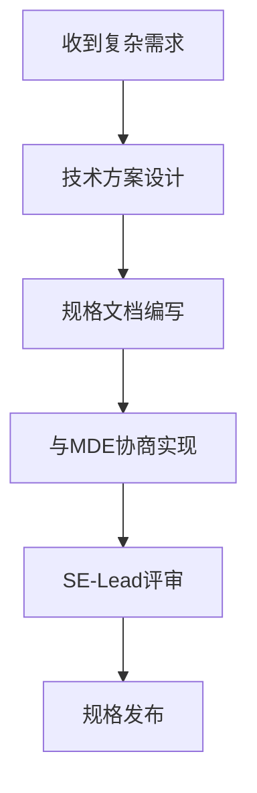
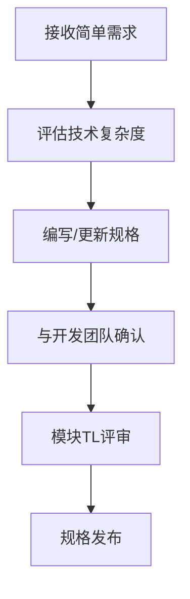
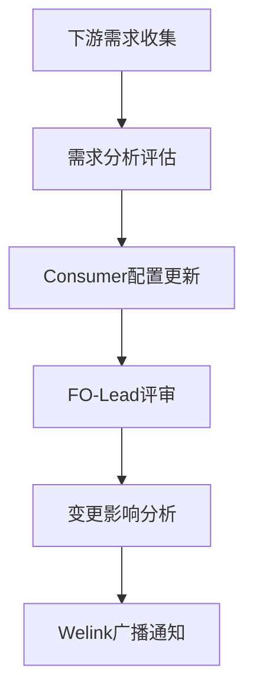
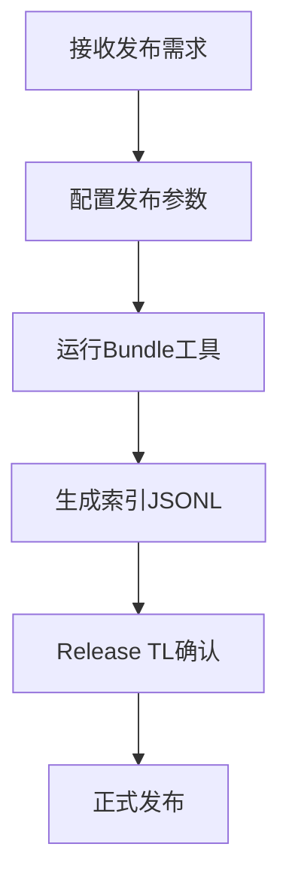
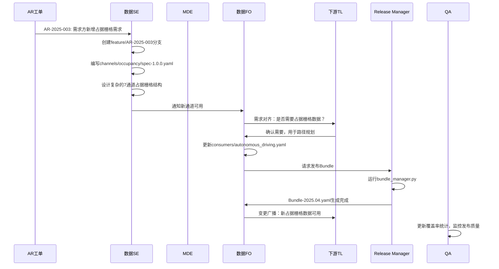

# 角色与职责定义 (实际运作版)

## 角色概览

| 角色 | 全称 | 主要职责 | 关键维护目录 |
|------|------|----------|--------------|
| **数据SE** | System Engineer | 复杂通道规格设计、方案制定 | `channels/<complex>/` |
| **MDE** | Module Design Engineer | 简单通道规格维护、模块设计 | `channels/<simple>/` |
| **模块TL** | Module Team Lead | 简单规格评审、模块决策 | `channels/<simple>/` |
| **FO** | Feature Owner | 特性需求交付责任人、变更协调 | `consumers/` |
| **RM** | Release Manager | 发布执行、Bundle生成 | `bundles/` |
| **QA** | Quality Assurance | 质量监控、覆盖度统计 | 全目录监控 |

## 目录责任矩阵 (RACI)

| 目录/文件 | 执行(R) | 拍板(A) | 协商(C) | 告知(I) |
|-----------|---------|---------|---------|---------|
| `channels/<complex>/` | **数据SE** | **数据SE** | MDE / QA | FO / RM |
| `channels/<simple>/` | **MDE** | **模块TL** | SE / QA | FO |
| `taxonomy/` | **SE** | **SE** (或SIG) | MDE | FO / QA |
| `consumers/` | **FO** | **FO** | 下游TL | SE / QA |
| `bundles/` | **RM** | **RM** | FO | QA |

## 详细角色定义

### 1. 数据SE (System Engineer)

#### 核心职责
- **复杂通道规格设计**：为技术难度高、影响面大的数据通道制定详细规格
- **技术方案制定**：制定数据格式、Schema设计、验证规则
- **跨团队技术协调**：与MDE团队协商技术实现方案

#### 负责的文件类型
```bash
channels/<complex>/
├── object_array_fusion_infer/  # 多传感器融合目标检测
├── occupancy/                  # 栅格占用检测
└── utils_slam/                 # SLAM工具链（复杂版本）
```

#### 典型工作流程


#### 实际工作示例
```yaml
# channels/occupancy/spec-1.0.0.yaml
# 由数据SE负责设计的复杂规格
meta:
  channel: occupancy
  version: 1.0.0
  category: perception_output
  description: "单帧场景占据栅格数据，包含静态场景和动态目标占据信息"
  
schema:
  data_format:
    type: occupancy_grid
    encoding: [zst]
    file_types:
      occupancy: "单帧场景占据，其中动目标使用3D box生成占据"
      occupancy_with_dyn_obj_mesh: "单帧场景占据，其中动目标使用mesh生成占据"
    
    data_structure:
      shape: [704, 448, 24, 7]  # (height, width, depth, channels)
      channels:
        min_z: {index: 0, type: float32, description: "体素最小Z坐标"}
        max_z: {index: 1, type: float32, description: "体素最大Z坐标"}
        is_occupancy: {index: 3, type: float32, description: "占据状态标识"}
        probability: {index: 6, type: float32, description: "占据概率"}
        
    coordinate_system:
      origin: "ego_vehicle"
      axes: "RDF"  # Right-Down-Forward
```

### 2. MDE (Module Design Engineer)

#### 核心职责
- **简单通道规格维护**：负责偏交付性质、技术复杂度较低的通道
- **配套开发团队协调**：与对应的数据生产团队保持紧密协作
- **规格实现落地**：确保规格能够有效指导实际数据生产

#### 负责的文件类型
```bash
channels/<simple>/
├── image_original/     # 原始图像数据
└── utils_slam/         # SLAM工具链（简单版本）
```

#### 典型工作流程


#### 实际工作示例
```yaml
# channels/image_original/spec-1.2.0.yaml
# 由MDE负责维护的简单规格 - 码率提升改进
meta:
  channel: image_original
  version: 1.2.0
  category: sensor_raw
  description: "原始JPEG图像数据，压缩码率从4Mbps提升至64Mbps，显著改善远距离图像清晰度"
  
schema:
  data_format: 
    type: image
    encoding: [jpeg]
    compression:
      bitrate: 64000000  # 64Mbps - 从4Mbps大幅提升
      quality: high
    average_file_size: "2.0MB"
    color_space: RGB
    bit_depth: 8
    
  metadata:
    data_source:
      type: string
      value: "camera_encoded_0.bag"
      description: "数据来源话题"
    camera_position: 
      type: string
      description: "相机位置标识"
      
validation:
  file_extensions: [".jpg"]
  max_file_size: "8MB"  # 增大文件限制以支持高质量压缩
  average_file_size: "2.0MB"
```

### 3. FO (Feature Owner)

#### 核心职责
- **特性需求交付责任人**：面向5-6个关键下游用户进行需求对齐
- **Consumer配置维护**：维护各下游团队的`consumers/*.yaml`文件
- **变更协调握手**：接收channel变更通知，主动与需求方握手确认

#### 负责的文件类型
```bash
consumers/
├── autonomous_driving.yaml    # 自动驾驶团队需求
├── perception_training.yaml   # 感知训练团队需求
├── simulation_platform.yaml   # 仿真平台需求
├── hd_mapping.yaml           # 高精地图团队需求
├── data_analytics.yaml       # 数据分析团队需求
└── validation_testing.yaml   # 验证测试团队需求
```

#### 典型工作流程


#### 实际工作示例
```yaml
# consumers/autonomous_driving.yaml
# 由FO维护的消费者配置
meta:
  consumer: autonomous_driving
  fo_owner: "zhang.wei@company.com"
  downstream_tl: "li.ming@ad-team.com"
  last_sync: "2025-01-15"
  
requirement_groups:
  perception:
    requirements:
      - channel: radar_fusion
        version: ">=1.0.0"
        required: true
        priority: critical
        rationale: "多传感器融合感知"
        
      - channel: image_original
        version: ">=1.2.0"
        required: true
        priority: high
        rationale: "视觉感知输入"

# FO负责的变更协调逻辑
change_coordination:
  notification_source: channels变更通知
  coordination_process:
    - step: 接收变更通知
      action: 识别影响的下游需求方
    - step: 主动联系握手
      action: 与需求方确认影响和需求
    - step: 更新consumer配置
      action: 基于握手结果更新配置
```

### 4. Release Manager (RM)

#### 核心职责
- **发布工具执行**：运行发布工具，输入生产配置
- **Bundle生成**：生成JSONL索引文件和Bundle配置
- **发布流程管控**：确保发布流程标准化执行

#### 负责的文件类型
```bash
bundles/
├── weekly_release/
│   ├── bundle-2025.03.yaml
│   └── bundle-2025.03.lock.json
├── training_bundle/
│   ├── bundle-v2.1.0.yaml
│   └── bundle-v2.1.0.lock.json
└── production_index/
    ├── autonomous_driving_2025.03.jsonl
    └── perception_training_v2.1.0.jsonl
```

#### 典型工作流程


#### 实际工作示例
```bash
# RM执行的发布命令
python scripts/bundle_manager.py create \
  --consumer autonomous_driving \
  --version 2025.03 \
  --lock-dependencies \
  --generate-index

# 生成的Bundle配置
cat bundles/weekly_release/bundle-2025.03.yaml
```

```yaml
# bundles/weekly_release/bundle-2025.03.yaml
meta:
  bundle_name: weekly_release
  version: "2025.03"
  created_by: "rm-team"
  created_at: "2025-01-20T10:00:00Z"
  consumer_ref: "autonomous_driving"
  
resolved_channels:
  - channel: radar_fusion
    version: "1.0.2"
    spec_path: "specs/radar_fusion/spec-1.0.2.yaml"
    
  - channel: image_original
    version: "1.2.1"
    spec_path: "specs/image_original/spec-1.2.1.yaml"
```

### 5. QA (Quality Assurance)

#### 核心职责
- **SPEC覆盖度监控**：持续监控规格定义的完整性和覆盖率
- **质量指标统计**：生成质量报告和Grafana面板
- **流程合规检查**：确保各角色按照定义的流程执行

#### 监控范围
```bash
# QA监控的质量指标
quality_metrics/
├── spec_coverage.py      # SPEC覆盖率统计
├── consumer_compliance.py # Consumer配置合规性
├── release_quality.py    # 发布质量检查
└── change_broadcast.py   # 变更广播及时率
```

#### 典型监控内容
```python
# scripts/spec_coverage.py
class QualityMetrics:
    def generate_coverage_report(self):
        """生成SPEC覆盖度报告"""
        return {
            'spec_coverage': self.calculate_spec_coverage(),
            'consumer_sync_rate': self.check_consumer_sync(),
            'release_success_rate': self.check_release_quality(),
            'broadcast_timeliness': self.check_broadcast_timing()
        }
        
    def calculate_spec_coverage(self):
        """计算SPEC覆盖率"""
        total_channels = self.count_production_channels()
        documented_channels = self.count_spec_files()
        return documented_channels / total_channels
```

## 完整工作流程

### 8阶段端到端流程

| 阶段 | 关键动作 | 主要产出 | 角色R/A/C/I | 重点目录/工具 |
|------|----------|---------|-------------|---------------|
| **1. 需求→任务** | 内部AR/RR/DTS工单 → `feature/AR-xxx`分支 | 任务分支、MR模板 | SE/MDE **R**<br>SE/TL **A** | Git、腾雾系统/DevOps系统 |
| **2. 规格编写** | 新建/修改`spec-X.Y.Z.yaml`，补样例 | 规范文件、样例 | SE/MDE **R**<br>SE/TL **A** | `channels/` |
| **3. Consumers维护** | 新增/更新`consumers/<team>.yaml` | Manifest文件 | **FO R**<br>FO **A**<br>下游TL **C** | `consumers/` |
| **4. CI审核** | Lint、Schema校验、`consumer_diff.py`回归 | MR检查结果 | QA/CI-Bot **R**<br>SE **C** | GitHub Actions |
| **5. MR评审合并** | CODEOWNERS逐项签字 | 变更合入`main` | SE/TL **A** | GitHub MR |
| **6. 版本发布** | RM运行发布工具，生成索引JSONL + Bundle/Lock | `bundles/bundle-*.{yaml,lock.json}` | **RM R**<br>RM **A** | `bundle/create_bundle.py` |
| **7. 变更协调** | FO接收通知，主动握手，更新consumer配置 | 需求对齐结果、配置更新 | **FO R**<br>下游TL **C** | 握手会议、配置更新 |
| **8. 质量监控** | Nightly统计Spec覆盖率 & 广播及时率 | Grafana面板 | **QA R**<br>QA-Lead **A** | `scripts/spec_coverage.py` |

### 实际协作示例

#### 场景：新增occupancy栅格占用通道



## 关键工具和脚本

### 1. 发布工具
```bash
# 由RM执行的核心发布命令
python scripts/bundle_manager.py create \
  --consumer autonomous_driving \
  --version 2025.03 \
  --lock-dependencies \
  --generate-index
```

### 2. 变更广播工具
```bash
# 由FO执行的变更通知
python scripts/broadcast_change.py \
  --channels radar_fusion \
  --consumers autonomous_driving,perception_training \
  --message "新增多传感器融合数据，请更新配置"
```

### 3. 质量监控工具
```bash
# 由QA执行的质量检查
python scripts/spec_coverage.py --generate-report
python scripts/consumer_diff.py --check-regression
```

这个组织架构确保了**专业分工明确**、**决策链路清晰**、**质量有效保障**，同时保持了**敏捷响应**下游需求的能力。

## 相关文档

有关高级配置管理策略（包括实验性数据管理、多层级Bundle策略和临时Consumer配置管理），请参考：
- [高级配置管理方案](ADVANCED_CONFIGURATION_MANAGEMENT.md) 